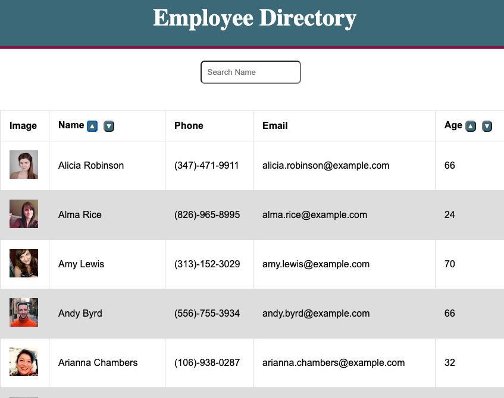

# Employee-Directory

## Description

This is a employee-directory application built with React. The application renders random users in a table and users can sort and filter to quickly find specific employees.

## Table of Contents

* [Description](#description)
* [User Story](#user-story)
* [Installation](#installation)
* [Usage](#usage)
* [License](#license)
* [Contributing](#contributing)
* [Tests](#tests)
* [Questions](#questions)
* [Deployed Application URL](#deployed-application-URL)

## User Story

As a user, I want to be able to view my entire employee directory at once so that I have quick access to their information.

## Installation

No installation needed. If cloning, repo do an npm install.

## Usage

The deployed application link will take you to the homepage. To start searching for an employee type in the name of the employee in the search field. You can sort the list alphabetically by name or numerically by age.

## License

## Contributing

Please follow standard contributing guidelines.

## Tests

No tests to run.

## Questions

For any questions, please contact kendayao at kendayao@gmail.com

## Deployed Application URL

Deployed application link:

